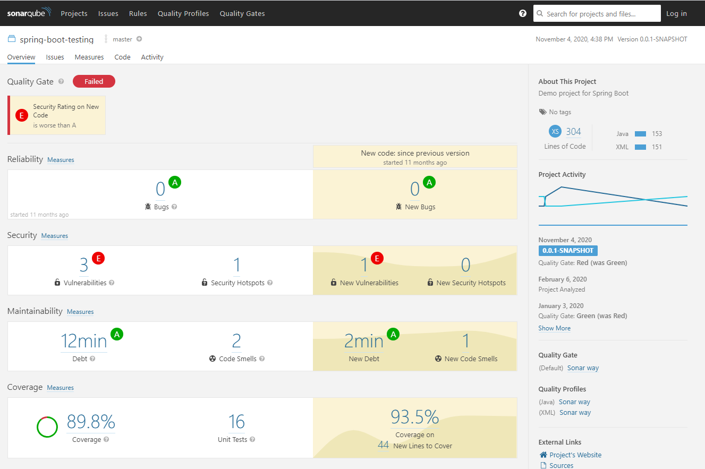

# Spring Boot Rest API

<a href="https://github.com/teten-nugraha/spring-boot-rest-api">
    
</a>

## Introduction

> Adalah sebuah simple project membuat CRUD data User menggunakan Spring Boot. Dalam project ini juga disertakan file unit test untuk masing-masing layer nya (service dan controller).
Dalam project ini juga menggunakan library Jacoco untuk generate codecoverage report yang nantinya akan di gunakan oleh Sonarqube untuk melihat persentase coveragenya.

## Prerequisites
1. Maven Build Tool
2. OpenJDK
3. IDE (Intelljidea atau STS)
4. Sonarqube Community Edition

## Installation

````
git clone https://github.com/teten-nugraha/spring-boot-rest-api.git
````

kemudian bisa dibuka menggunakan Intelljidea ataupun STS, atau bisa langsung di build dengan sintak

````
mvn clean install
````

###Build With
Project ini dibangun menggunakan :
- OpenJDK 11
- Spring v2.3.5


